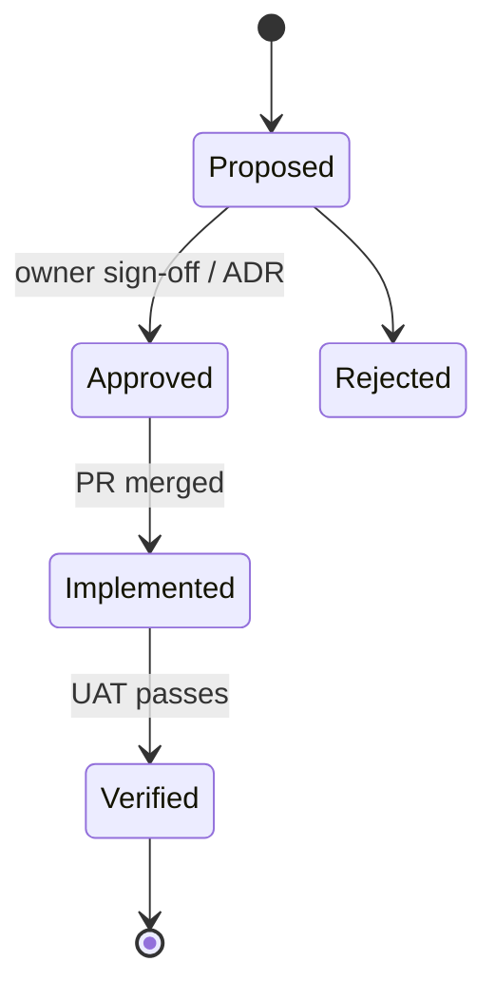

# Change Requests — demo-poll

<!-- AGENT GUIDANCE (invisible when rendered):
     Append-only log: never edit a past row — append a new one. Amending an approved
     requirement always opens a CR. A behavior-changing PR appends its CR row in the
     same PR (/sop-cmmi §3 delta discipline). -->

## Change Lifecycle

## Change Log

| CR-id | Date | REQ-id | Change | Reason | PR | Status |
|-------|------|--------|--------|--------|----|--------|
| CR-001 | 2026-07-20 | REQ-DEMOPOLL-NNN | _what changes_ | _why_ | #NN | Proposed |

## Revision History

| Version | Date | REQ/CR-id | Author | Change | PR |
|---------|------|-----------|--------|--------|----|
| 0.1.0 | 2026-07-20 | — | wind | Initial scaffold | — |
