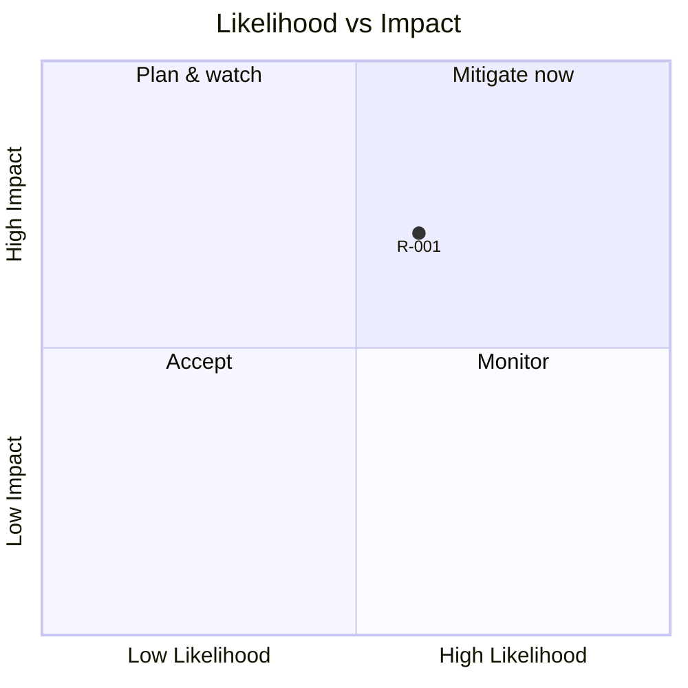

# Risks, Decisions & Corrective Actions — demo-poll

<!-- AGENT GUIDANCE (invisible when rendered):
     Three registers in one doc: risks (live), decisions (index of docs/adr/), corrective
     actions (post-incident). One ADR file per decision in docs/adr/NNNN-slug.md, written
     at decision time; every ADR gets an index row here and every index row resolves to a
     real file (doc-sync validates both directions). SaaS/multi-tenant systems require an
     ADR before build — data isolation, quotas, and billing change the architecture class. -->

## Risk Register

| Risk-id | Risk | Likelihood | Impact | Mitigation | Owner | Status |
|---------|------|-----------|--------|-----------|-------|--------|
| R-001 | _what could go wrong_ | Med | High | _action that reduces it_ | wind | open |

## Decisions (ADR Index)

| ADR | Title | Status | Date |
|-----|-------|--------|------|
| [0001](adr/0001-slug.md) | _decision title_ | accepted | 2026-07-20 |

## Corrective Actions

| CAR-id | Incident | Root cause | Fix | Prevention |
|--------|----------|-----------|-----|-----------|
| C-001 | _what broke_ | _mechanism, not symptom_ | _what was changed_ | _the guard that stops recurrence_ |

## Revision History

| Version | Date | REQ/CR-id | Author | Change | PR |
|---------|------|-----------|--------|--------|----|
| 0.1.0 | 2026-07-20 | — | wind | Initial scaffold | — |
