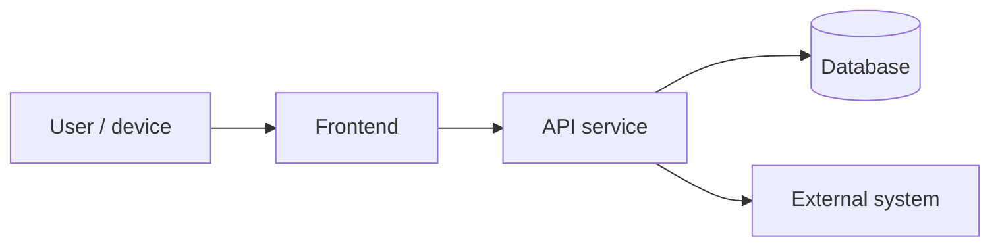
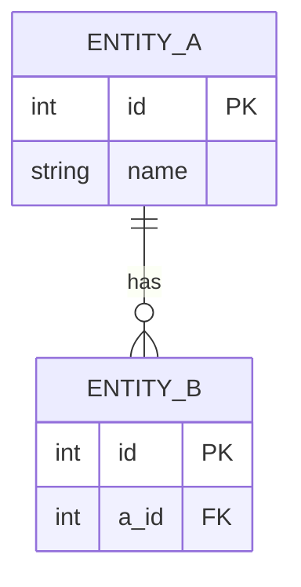
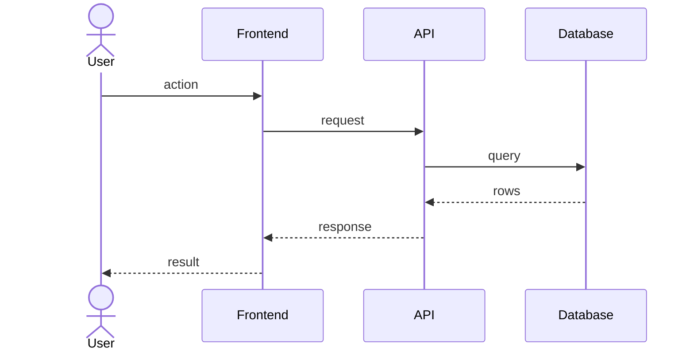

# Software Design — demo-poll

<!-- AGENT GUIDANCE (invisible when rendered):
     This doc is GENERATED from current code on demand (release/audit/onboarding) — never
     hand-maintained. Regenerate the diagrams as a snapshot; prior versions live in git history.
     Structure follows the Google design-doc frame: context → goals/non-goals → design →
     decisions. Diagrams are C4-style: context/container level only — no class diagrams.
     A design doc argues trade-offs; it does not narrate the code. -->

## Context

_One paragraph: what this system is, who depends on it, and the one constraint that most shaped the design._

## Goals / Non-Goals

| Goals | Non-Goals |
|-------|-----------|
| _what the design must achieve_ | _explicitly not solved here, and why_ |

## Architecture

| Component | Responsibility | Realises | Key decision |
|-----------|----------------|----------|--------------|
| _name_ | _single-sentence responsibility_ | REQ-DEMOPOLL-001 | [ADR-0001](adr/0001-slug.md) |

## Data Model

## Key Flow

## Deployment

| | |
|---|---|
| **Target** | _where it runs (host, container, service)_ |
| **Pipeline** | _how a merge reaches production_ |
| **Rollback** | _how a bad release is reverted_ |

## Alternatives Considered

_One line per rejected direction, each linking its ADR: what was rejected and the single deciding reason._

## Revision History

| Version | Date | REQ/CR-id | Author | Change | PR |
|---------|------|-----------|--------|--------|----|
| 0.1.0 | 2026-07-20 | — | wind | Initial scaffold | — |
