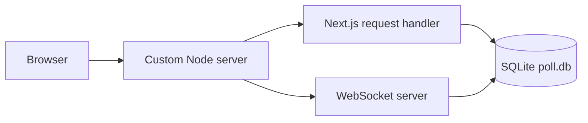
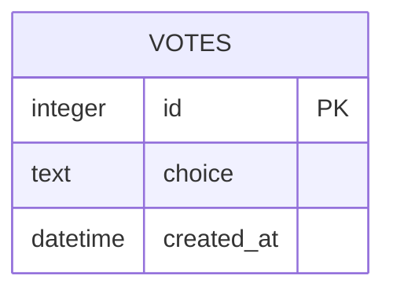
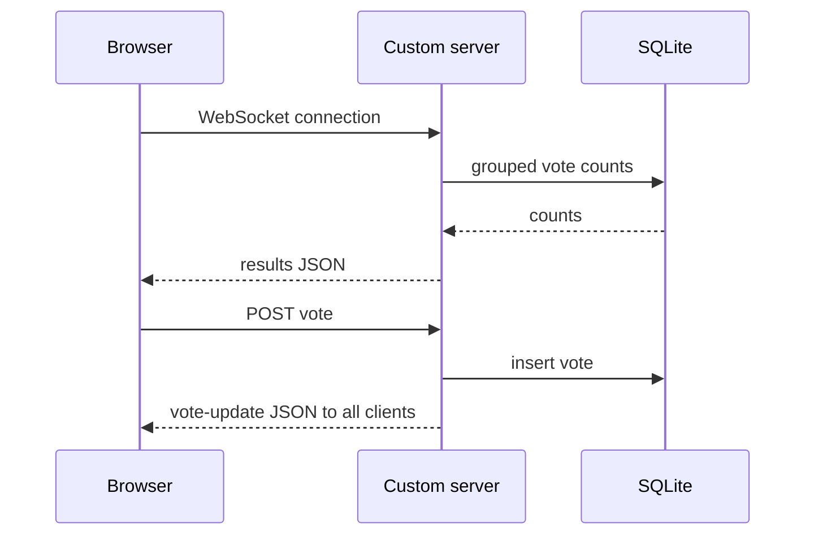

# Software Design — demo-poll

<!-- AGENT GUIDANCE (invisible when rendered):
     This doc is GENERATED from current code on demand (release/audit/onboarding) — never
     hand-maintained. Regenerate the diagrams as a snapshot; prior versions live in git history.
     Structure follows the Google design-doc frame: context → goals/non-goals → design →
     decisions. Diagrams are C4-style: context/container level only — no class diagrams.
     A design doc argues trade-offs; it does not narrate the code. -->

## Context

Quick Poll is a single-process Next.js application for live lunch voting. It keeps the HTTP application and WebSocket clients on one Node.js port so every connected voter can receive results without a separate real-time service.

## Goals / Non-Goals

| Goals | Non-Goals |
|-------|-----------|
| Persist votes locally and broadcast current results to every connected client. | Multi-instance coordination, authentication, and durable hosted-database operations. |

## Architecture

| Component | Responsibility | Realises | Key decision |
|-----------|----------------|----------|--------------|
| `server.ts` | Hosts Next.js HTTP handling and the WebSocket server on `PORT` or port 3000. | REQ-DEMOPOLL-002 | One process owns both protocols. |
| `src/lib/db.ts` | Initializes SQLite and provides parameterized vote reads and inserts. | REQ-DEMOPOLL-003 | Keep persistence local for the demo. |
| `src/lib/ws.ts` | Sends initial vote counts on connect and broadcasts JSON to all open clients. | REQ-DEMOPOLL-002, REQ-DEMOPOLL-003 | API routes use the loopback broadcast endpoint to preserve the server module's singleton identity. |

## Data Model

## Key Flow

## Deployment

| | |
|---|---|
| **Target** | Node.js process running `tsx server.ts` with a writable working directory for `poll.db`. |
| **Pipeline** | `npm run build`, then `npm start`. |
| **Rollback** | Redeploy the preceding application revision; `poll.db` is retained unless an operator deliberately replaces it. |

## Alternatives Considered

Separate HTTP and WebSocket services were rejected for this demo because one custom server provides both protocols without an additional deployment boundary.

## Revision History

| Version | Date | REQ/CR-id | Author | Change | PR |
|---------|------|-----------|--------|--------|----|
| 0.1.0 | 2026-07-20 | — | wind | Initial scaffold | — |
| 0.1.3 | 2026-07-20 | #11 | Oracle (Codex) | Documented the delivered custom-server, SQLite, and WebSocket architecture. | pending |
