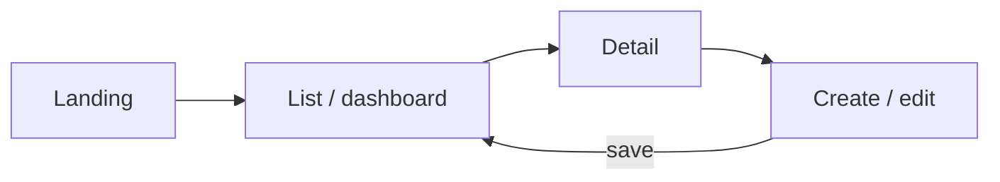

# UX/UI Specification — demo-poll

<!-- AGENT GUIDANCE (invisible when rendered):
     Authored via /sop-frontend (+ /sop-uxui for design-system work). Backend-only
     projects mark this doc N/A in one line and stop. Tokens come from the project's
     root DESIGN.md (or the brand skill's canonical DESIGN.md) — never restate hex here.
     Every screen row must exist as a real route/component; every screen ships all
     states (loading/empty/error/ready). WCAG AA · ≥44px touch targets. -->

## Screen Flow

## Screen Inventory

| Screen | Route | Primary action | States covered | REQ-id |
|--------|-------|----------------|----------------|--------|
| _name_ | _/path_ | _the one job_ | loading · empty · error · ready | REQ-DEMOPOLL-001 |

## Design Tokens

Canonical token source: the project root `DESIGN.md` (exported from the brand skill — `/nwf-theme`, `/sl-theme`, or `/doctor-theme`). This doc references tokens; it never redefines them.

## Revision History

| Version | Date | REQ/CR-id | Author | Change | PR |
|---------|------|-----------|--------|--------|----|
| 0.1.0 | 2026-07-20 | — | wind | Initial scaffold | — |
