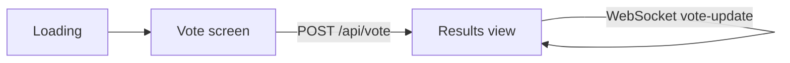

# UX/UI Specification — Quick Poll

## Screen Flow

## Screens

| Screen | User-visible behavior | Source |
|---|---|---|
| Loading | Poll loading message while `GET /api/poll` resolves | `src/app/page.tsx` |
| Vote screen | Question and eight emoji choice cards; cards disable while the vote is submitted | `src/app/page.tsx` |
| Results view | Voted choice, sorted animated horizontal bars, and total vote count | `src/app/page.tsx` |
| Error | Inline error message when poll loading or voting fails | `src/app/page.tsx` |

`localStorage` preserves the selected choice across refreshes. A WebSocket connection updates result bars from `vote-update` messages and reconnects after two seconds.

## Responsive
- Mobile-first: two-choice card columns at 320px+
- Desktop: four-choice card columns at 640px+ in a centered `max-w-3xl` layout
- Choice cards and controls meet a 44px minimum touch target
